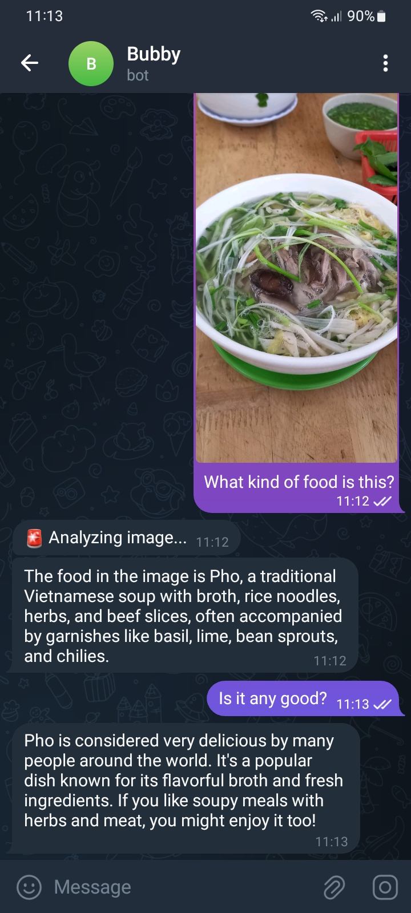
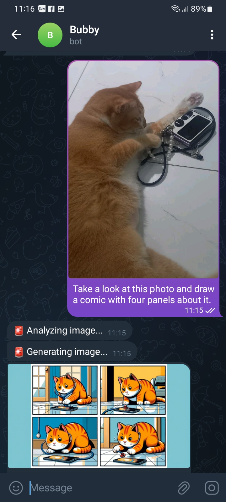

# Telegram bot powered by OpenAI

## Usage

| Chat with `gpt-4-1106-preview`    | Analyze image with `gpt-4-vision-preview`           | Generate with `dall-e-3`                                                  |
|-----------------------------------|-----------------------------------------------------|---------------------------------------------------------------------------|
|  |  |  |

## Roadmap

- [x] Integrate with Assistants API
- [x] Use GPT-4 Turbo model for conversation
- [x] Use Vision Preview model for image analysis
- [x] Use DALL-E 3 model for image generation
- [ ] Add support for memory recall
- [ ] Add support for reminders

## Deployment

The bot is configured with a whitelist to ensure it only responds to recognized users, helping to prevent unnecessary OpenAI costs.
To effectively test this feature, you'll need to set up your own deployment environment and utilize your personal API key.
Apologies for any inconvenience this may cause.

```shell
# this project uses PNPM instead of NPM
npm install --global pnpm

# install dependencies
pnpm install

# set secrets for the local stage
## create new secret key at https://platform.openai.com/api-keys
pnpm sst secrets set OPENAI_API_KEY sk-xxx 
## create new assistant at https://platform.openai.com/assistants
pnpm sst secrets set OPENAI_ASSISTANT_ID asst_xxx
## chat with https://t.me/BotFather to create a new bot
pnpm sst secrets set TELEGRAM_BOT_TOKEN '123:xxx'
## use https://www.random.org/passwords/ or similar tool to generate a random password
pnpm sst secrets set TELEGRAM_WEBHOOK_SECRET_TOKEN s3cret

# this project use SST to deploy to AWS
# use its dev command for https://docs.sst.dev/live-lambda-development
pnpm dev

# register webhook
curl https://api.telegram.org/bot${TELEGRAM_BOT_TOKEN}/setWebhook \
  -F url=https://xxx.execute-api.us-east-1.amazonaws.com/api/webhook \
  -F secret_token=${TELEGRAM_WEBHOOK_SECRET_TOKEN}

# check webhook status
curl https://api.telegram.org/bot${TELEGRAM_BOT_TOKEN}/getWebhookInfo
```
